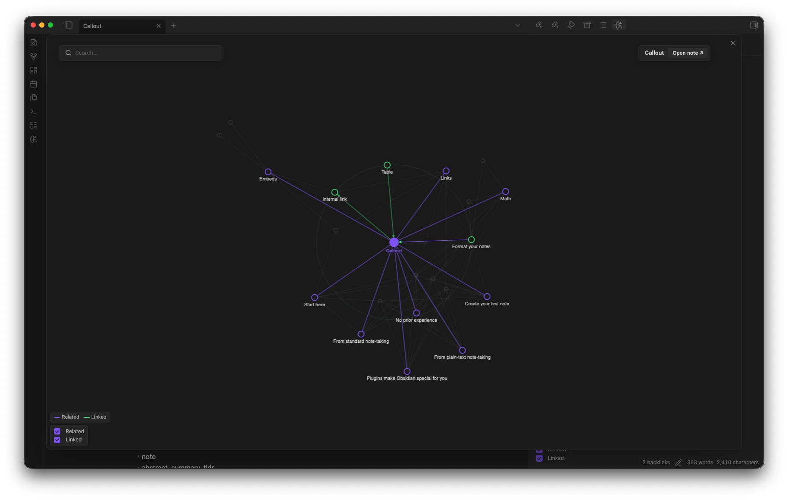
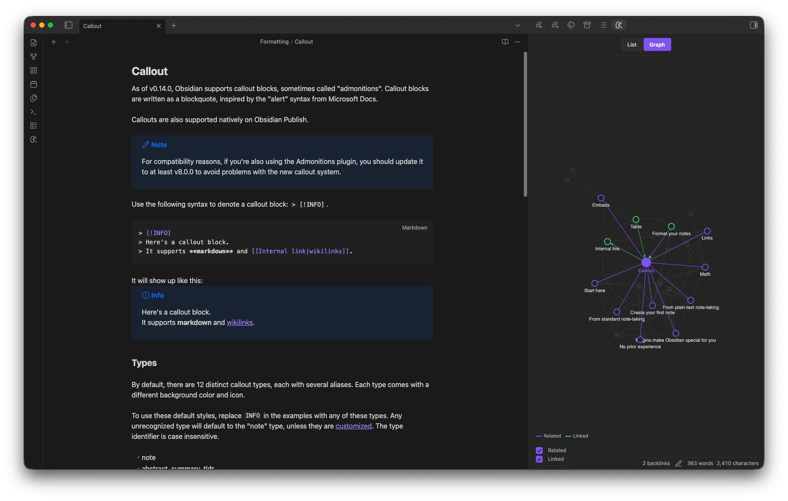

# Proxima

Proxima surfaces notes that are semantically similar to the note you're currently viewing, and lets you search for notes based on semantic meaning rather than exact words.

> **Why "Proxima"?**
> Proxima means "nearest." It finds the notes conceptually nearest to the one you're reading, not just the ones sharing the same words.

## Screenshots

### Interactive Proxima Graph
Shows notes conceptually close to the current note.



### Related Notes Sidebar
Surfaces notes that are conceptually related to the current note based on their content.


### Proxima Graph in Sidebar
Visual representation of the conceptually related notes in the side bar.



### Plugin Settings
Configure indexing, embedding and reranking models, and how related notes are matched.


Fine-tune matching mode, result limits, similarity thresholds, and debug logging.


## Highlights

- **Related Notes View:** Surfaces notes conceptually similar to the current one.
- **Proxima Graph:** An interactive graph of conceptually related notes, with hover previews.
- **Wikilink overlay:** Explicit `[[links]]` and backlinks appear alongside semantic matches — as badges in the related notes list and as a themed orbit ring in the graph.
- **Two-Stage Funnel:** Dense vector retrieval refined by an on-device cross-encoder reranker for high precision.
- **Meaning-aware chunking:** Notes are split on markdown structure and sentence/paragraph boundaries — not random overlapping windows — so semantic matches are more accurate.
- **100% Local & Private:** Runs entirely on-device via WebGPU/WASM. Zero telemetry, no cloud APIs, no external subscriptions.

## Meaning-aware chunking

Most semantic tools slice text into fixed, overlapping windows. Proxima reads your notes the way you wrote them.

- **Markdown-aware:** it reads your note's structure — headings, sections and subsections, tables, and lists — so chunks line up with how you organized the note.
- **Sentence-safe:** it respects paragraph and sentence boundaries, so each chunk ends at a natural break rather than cutting a thought mid-sentence.
- **Context-preserving:** every chunk carries its note title and section heading, so the embedding knows *where* the text lives, not just *what* it says.

Because each embedding captures a whole idea instead of an arbitrary slice, similarity scores track meaning — and your related notes are more accurate.

## Privacy

- All embedding computation, vector search, and reranking run **locally** on your GPU/CPU.
- The only network access is a **one-time download** of model weights from Hugging Face on first activation (cached locally in your browser/vault cache).
- Vault notes are never transmitted or modified. The index is stored strictly in `.obsidian/plugins/proxima/`.

## Desktop only

Proxima requires WebGPU (with a WASM fallback) for on-device inference, which Obsidian only exposes in its desktop Electron shell, not on mobile. `isDesktopOnly` is set deliberately for this reason, not as a placeholder.

## Settings

- **Vault indexing:** Manually re-index the vault (runs automatically on startup/changes).
- **Debug logging:** Toggle detailed indexing and performance logs in the developer console.
- **Embedding model:** Choose the semantic model for vector search. `Gemma 300M` for high accuracy, or `All MiniLM L6` for faster performance on older devices. Changing models triggers a re-index.
- **Reranking model:** Shows the active cross-encoder (`MiniLM L6`). Currently cannot be changed; future enhancements may add other models.
- **Matching mode:** Choose how related notes are found (Detailed, Focused, or Broad).
- **Open related notes in new tab:** Open clicked related notes in a new tab instead of the current one.
- **Related notes:** Maximum number of related notes to show.
- **Sections per note:** Maximum number of matching sections shown per related note.
- **Minimum similarity:** Threshold for matches (higher = stricter).

## Commands

| Command | Action |
| :--- | :--- |
| `Open graph` | Opens the full-screen interactive Proxima graph |
| `Show related notes` | Toggles the related notes companion sidebar |
| `Reindex notes` | Manually triggers a re-index of new or modified vault notes |

## Development

```bash
npm install
npm test       # run vitest test suite
npm run dev    # watch-mode incremental build
npm run build  # type-check and production bundle
npm run lint   # eslint validation
```

### Manual Testing in Obsidian

1. Run `npm run build` to generate `main.js`.
2. Copy `main.js`, `manifest.json`, and `styles.css` to `<Vault>/.obsidian/plugins/proxima/`.
3. In Obsidian, go to **Settings → Community plugins** and enable **Proxima**.

## Documentation

- [Technical Architecture](docs/architecture.md): deep dive on the chunking pipeline, index storage, and inference engine.
